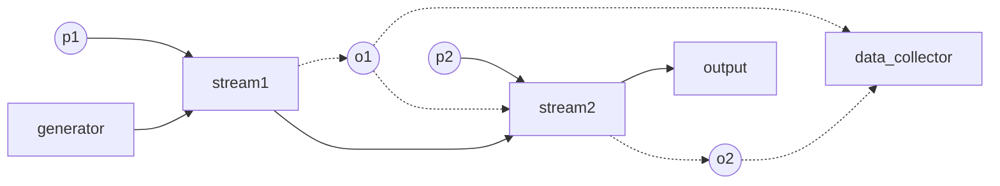

# Ruci

## 项目名称

- [X] Ruci : 如此：
- [X] Rucimp: 如此实现~
- [ ] Rucimple: 如此简单！

项目命名采用了谐音。同时Ru指代rust, ruci 与 如此谐音 ,cimple则与 simple 谐音。
Rucimple可读作：如森剖。根项目可读作"如C"或 lucy。
在与 verysimple 对比的语境中，本项目也可称rp，verysimple 可称 vp

## 项目目的

本项目是 [verysimple](https://github.com/e1732a364fed/v2ray_simple) 项目的继承者，是一个网络代理项目，采用rust(Rust 2021 edition 1.75+)

rucimple 对代理架构 做了比verysimple 中更高级的抽象，因此功能更强大. 
verysimple可以说是一个初级项目，而ruci最终将成为一个中级项目.

文档所限，肯定有东西没有涉及到，可提交issue提问或加入讨论。
本项目不是一个人能做完的，所以欢迎加入我们。注意低调。

开发级讨论群:     https://t.me/+6yL4ggeyKY0yNjIx
用户级channel:    https://t.me/+r5hKQKYyeuowMTcx


#### 为什么要自行实现协议？

因为我们要了解协议的细节，以进行数据处理、转换到统一格式和“标注”.

详见 [终极目标]( doc/GOAL_zh.md)

## 整体结构
整个项目分成三部分。
ruci 中定义一些trait 和基本结构与方法，定义代理的单元结构，定义了链式架构的基础，实现了一些基本协议, 提供转发方法

rucimp 中提供若干代理协议, 并定义多种配置文件格式

rucimple 是最终的全功能的可执行文件，利用rucimp中的实现构造出一个程序

根据rust 包结构的特点，每个 lib 包都可以有若干binary，所以rucimp 也有提供一个叫rucimp的可执行文件，但它是功能单一、不全的。若想使用全部功能，还是要用 rucimple.

因为 ruci 和 rucimp 是库项目，所以根目录没有 Cargo.lock。rucimple 项目在另外的github 仓库中保管

ruci根项目只提供 一些 经典、简单的 流映射函数, 以及一些辅助的 流映射函数（如 Counter, MathAdder 等）, 以及一些流发生器 (listen tcp, dial tcp, stdio 等)，其它第三方协议要在 rucimp 或第三方包中实现

## 配置模式

由下文可知，ruci现在支持两种配置格式，

1. "suit模式"，是扁平配置，兼容verysimple的 toml格式
2. "chain模式", 链式配置，是新的lua格式。

lua格式可参考 [用例](resource/config.chain.lua)  和 [lua配置功能](doc/lua.md) 

项目还在开发中，功能会陆续添加

两种配置模式目前可由不同的示例程序运行，如下。

## 目前的编译执行方式

rucimp 子项目提供若干示例程序, suit, suit2, chain

linux/macOS 上的shell编译命令

```sh
cd rucimp
cargo build --release --example chain --example suit  --example suit2 

#到 ruci/target/release/examples 找可执行文件，拷回 .toml 或resource文件夹 所在的位置

cd ..
cp target/release/examples/suit .
cp target/release/examples/suit2 .
cp target/release/examples/chain .
```

详见 [exmaples](rucimp/examples/readme.md)


## 开发

采用TDD开发模式。具体见 [doc/CONTRIBGUITING_zh.md](doc/CONTRIBUTING_zh.md)

### 异步架构

为了避免有人说笔者抄袭，在项目初期笔者选用了 async_std。
后来才创建的 tokio 分支，可查看commit历史 求证。
不过难以维护两套异步架构，现在async_std分支只能作为参考了。

### 链式结构

ruci对代理的原理加以更高的抽象化，认为任何协议都可被认定为一个"函数"

有如下定义(伪代码)：

单流发生器(stream generator)： function(args)->stream

多流发生器(multi-stream generator)：function( Option<stream> ,args...)->[channel->stream]

流映射函数( stream mapping function)： function(stream1, args...)-> (Option<stream2>, useful_data...) 

流由流发生器产生。

流发生器是一种可不接受流参数的 流映射函数，是整个链的起点，是流的源。

单流发生器可能是 dial tcp, 文件, 或者 stdio, 多流发生器可能是 listen tcp 或 mux

流映射函数可以改变流，也可以不改变，也可以消耗掉流，也可以替换掉流的源。消耗流的函数是整个链的终点。

如此，整个架构由verysimple 的扁平结构转化成了链式结构。这种抽象把代理分成了一个一个小模块，任由你拼接。


虽然看起来没有什么区别，但是，你可以很方便地构建一些独特的结构，比如 TLS+TLS (用于分析 tls in tls, 你甚至可以累加N个，变成N*TLS)，比如 TCP-Counter-TLS-Counter-TLS-Counter-Socks5-Counter (Counter用于统计流量，并将数据原样传递，这样每一层的流量就都统计出来了)

其它可能的情况比如 Socks5+WS+TLS+WS+Socks5+TLS.，甚至你可以造出一些逻辑结构，只要有最终出口就行，如 Socks5 - repeat N [TLS1-TLS2] - Socks5
发挥你的想象力吧。

而作为兼容vp的suit配置格式实际上也是运行在链式结构中的。因此 rp 将比vp更通用，功能更多，自定性更高。

能够定义动态的链式结构 (如有循环和跳转)的链式配置文件要采用脚本语言格式。 这里使用 Lua


经典链

```
# classic chain

          p1       p2
            \       \
generator->[s1] -> [s2] -> [ output ]
             \       \
             o1  ->  o2 ->

# where s1 is tls and s2 is trojan
# generator is tcp
# p1 is tls settings, o1 is the tls state (alpn, etc...)
# p2 is trojan settings, like the password
# o2 is the trojan state
# output is the encoded client stream
```




### Roadmap

- [x] 链式架构 
- [x] suit配置格式 （即旧 verysimple 的 toml 配置）
- [x] 链式配置格式 (新增)
- [x] 代理程序 (rucimp/examples: suit 或 chain )
- [x] 日志 (env_logger)
- [x] 流量记录 (两种实现，分别用于记录原始流量与实际流量)
- [x] Direct,Blackhole, TcpListener, TcpDialer, Stdio
- [x] tls,socks5,http proxy, socks5http, trojan
- [x] Adder (按字节加法器), Counter (层流量计)
- [ ] unix domain socket
- [x] 路由
- [ ] 回落
- [ ] DNS

#### 其它

http header，websocket

上面只是写了下一阶段要实现的。

最终一定要实现所有现有的主流的代理协议，实现之后，我们的墙才能就检测它们，实现的越多，墙越高级。详见 [终极目标]( doc/GOAL_zh.md)
而且，最好是多实现一些变体，或奇葩协议。


### 开源协议

This project is licensed under the MIT License
