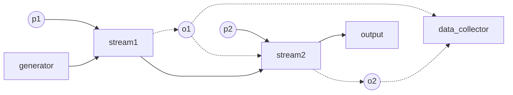

# Ruci (wip)

- [X] Ruci : 如此: 
- [X] Rucimp: 如此实现~
- [X] ruci-cmd: 如此简单！ 见 [ruci-cmd](crates/ruci-cmd/README.md)

项目命名采用了谐音. 同时Ru指代rust, ruci 与 如此谐音.
rucimp = ruci + imp,
ruci pronounced lucy. 

## Intro

A network proxy framework uses rust(Rust 2021 edition 1.75+)

See [notes.md](doc/notes.md) for more notes 

文档所限, 肯定有东西没有涉及到, 可提交issue提问或加入讨论. 
欢迎加入我们. 注意低调. 

一个好的解决问题的模式: 有暂时不懂的问题可以先进群问, 确定问题后再发 issue

开发级讨论群:     https://t.me/+6yL4ggeyKY0yNjIx
用户级channel:    https://t.me/+r5hKQKYyeuowMTcx

项目还在开发中, 功能会陆续添加


## Structure
The project is divided to three main parts:

ruci is the base framewark, defines some concepts like【映射】(Mapper), 动态Mapper迭代器 DMIter; 
implements chain structure, implements some basic Mappers; provide some useful relay facilities.

rucimp provides more Mappers, defines multiple config modes, provides some example binaries.
rucimp is the core.

ruci-cmd 是最终的全功能的可执行文件, 包含一些系统路由的配置功能 和 api-server

具体名词解释请看下文. 

## 配置模式

由下文可知, ruci现在支持两种配置格式, 

1. "suit mode", 是扁平配置, toml格式. (suit 含义是 "套装")
2. "chain mode", 链式配置, lua格式. 

lua格式可参考 [用例](resource/local.lua)  和 [lua配置功能](doc/lua.md) 

两种配置模式目前可由不同的示例程序运行, 如下. 

## 编译/执行方式

### ruci-cmd

See [ruci-cmd](crates/ruci-cmd/README.md)


### rucimp/examples

rucimp 提供若干示例程序, suit, chain 等

See [exmaples](rucimp/examples/README.md)


# Dev

TDD. See [doc/CONTRIBGUITING_zh.md](doc/CONTRIBUTING_zh.md)

## Chain Structure Explained

ruci对代理的原理加以更高的抽象化, 认为任何协议都可被认定为由一个或多个【映射】组成

有如下定义(伪代码): 

单流发生器(stream generator):  function(args)->stream

单射(normal stream mapper):  function(stream1, args...)-> (Option<stream2>, useful_data...) 

多流发生器(multi-stream generator): function( Option<stream> ,args...)->[channel->stream]

流由流发生器产生. 

流发生器是一种不接受流参数, 只接受其它参数的函数, 是整个链的起点, 是流的源

单流发生器可能是 Dialer, 文件, 或者 Stdio.

多流发生器可能是 Listener (不接受流参数的无中生有) 或 inner mux (接受一个流, 对其进行分支处理)

流映射可以改变流(如Tls), 也可以不改变而只是在内容上做修改(如Adder),

也可以完全不做修改而只提供副作用(如 Counter, 或Trojan/Socks5 先做握手然后不改变流) 

也可以消耗掉流(如 Echo (持有对流的所有权, 自己建立relay loop); Blackhole; 
再如 relay 转发过程 将 in 和 out 调转对接, 同时消耗in 和 out 两个流), 

消耗流的映射是整个链的终点 . 

也可以替换掉流的源(如socks5中的 udp associate, 是持有tcp流的所有权后, 产生并返回一个新的udp流). 

如此, 整个架构抽象把代理分成了一个一个小模块, 任由你拼接. 


虽然看起来没有什么区别, 但是, 你可以很方便地构建一些独特的结构, 比如 TLS+TLS (用于分析 tls in tls, 
你甚至可以累加N个, 变成N*TLS), 比如 TCP-Counter-TLS-Counter-TLS-Counter-Socks5-Counter 
(Counter用于统计流量, 并将数据原样传递, 这样每一层的流量就都统计出来了)

其它可能的情况比如 Socks5+WS+TLS+WS+Socks5+TLS., 甚至你可以造出一些逻辑结构, 只要有最终出口就行, 
如 Socks5 - repeat N [TLS1-TLS2] - Socks5

发挥你的想象力吧. 

而作为suit配置格式实际上也是运行在链式结构中的

能够定义动态的链式结构 (如有循环和跳转)的链式配置文件要采用脚本语言格式.  这里使用 Lua

只会返回 有限个Mapper可能 的动态链 是一种 有限状态机. 静态链是一种特化的有限状态机, 其状态转换函数是 fn(i)->++i


经典链

```
# classic chain

          p1       p2
            \       \
generator->[s1] -> [s2] -> [ output ]
             \       \
             o1  ->  o2 ->

# where s1 is tls and s2 is trojan
# generator is tcp
# p1 is tls settings, o1 is the tls state (alpn, etc...)
# p2 is trojan settings, like the password
# o2 is the trojan state
# output is the encoded client stream
```




## Roadmap

### ruci

- [x] 链式架构 
- [x] tcp, udp, unix domain socket, ip (tun)([tun example](rucimp/examples/README.md#tun))
- [x] 流量记录 (两种实现, 分别用于记录原始流量(GlobalTrafficRecorder)与实际流量(Counter)) 与实时单连接流量监控 (trace feature)
- [x] Direct, Blackhole, Listener, Dialer, Stdio, Fileio
- [x] Tls, Socks5(+ UDP ASSOCIATE,USERPASS), Http proxy, Socks5http, Trojan
- [x] Adder (按字节加法器), Counter, Echo
- [x] 路由 (tag_route)
- [x] 回落
- [ ] DNS

### rucimp

- [x] suit配置格式 （toml 格式）
- [x] chain配置格式 (动态链须为lua格式)
- [x] 静态链
- [x] 动态链(有限动态链, 完全动态链)
- [x] rucimp/examples: suit , chain, etc.
- [x] 路由 (rule_route)
- [x] tproxy
- [x] native-tls
- [x] http_filter, websocket(including early data)
- [x] h2, grpc
- [ ] tcp/ip netstack (lwip/smoltcp)
- [ ] quic
- [ ] ss?, vmess?

### ruci-cmd

- [x] chain mode support
- [ ] suit mode support
- [x] api_server
- [x] api_client
- [x] utils
- [ ] system auto route

#### 项目的实际目的？

我们要了解协议的细节, 以进行数据处理、转换到统一格式和“标注”.

详见 [终极目标]( doc/GOAL_zh.md)


# 开源协议

This project is licensed under the MIT License
