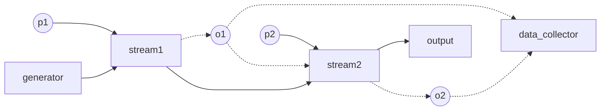

# Ruci (wip)

- [X] Ruci : 如此: 
- [X] Rucimp: 如此实现~
- [X] ruci-cmd: 如此简单！ 见 [ruci-cmd](crates/ruci-cmd/README.md)

项目命名采用了谐音. 同时Ru指代rust, ruci 与 如此谐音.
rucimp = ruci + imp,
ruci pronounced lucy. 

## Intro

A network proxy framework and toolbox written in Rust (Rust 2021 edition 1.75+)

用户 入门 ruci 可阅读 [ruci 用户手册](https://e1732a364fed.github.io/ruci/index.html)

（book源文件在[SUMMARY.md](doc/book/src/SUMMARY.md))

Developer 入门 ruci 可阅读 [Introduction_zh.md](doc/Introduction_zh.md)

See [notes.md](doc/notes.md) for more notes.

文档所限, 肯定有东西没有涉及到, 可提交issue提问或加入讨论. 
欢迎加入我们. 注意低调. 

一个好的解决问题的模式: 有暂时不懂的问题可以先进群问, 确定问题后再发 issue

Developer chat:     https://t.me/+6yL4ggeyKY0yNjIx

User channel:       https://t.me/+r5hKQKYyeuowMTcx

The project is work in progress, 功能会陆续添加与调整


## Structure

The project is divided to three main parts:

ruci is the base framewark, defines some concepts like【映射】(Map), 动态Map迭代器 DMIter; 
implements chain structure, implements some basic Maps; provides some useful relay facilities.

rucimp provides more Maps, defines the config mode(and file format), provides some example binaries.
rucimp is the core.

ruci-cmd is the ultimate full feature executable, including utils, api-client and api-server

具体名词解释请看下文. 

## Configuration Mode

For lua configuration, see [local.lua](resource/local.lua), [remote.lua](resource/remote.lua)  和 [lua配置说明](doc/lua.md) 
以及 [ruci 用户手册](https://e1732a364fed.github.io/ruci/index.html)

## Compile/Run

### ruci-cmd

full featured command-line executable.

See [ruci-cmd](crates/ruci-cmd/README.md)


### rucimp/examples

rucimp provides some example binaries for debugging and testing.

See [exmaples](rucimp/examples/readme.md)


# Dev

See [doc/CONTRIBGUITING_zh.md](doc/CONTRIBUTING_zh.md) for developper Contributing guidelines in 中文.

## What is "Proxy"

A proxy must have both an inbound and an outbound.

If the app only has an inbound, then it's just a regular web server.
If the app only has an outbound, then it's just a regular web browser.

On client side, having both an inbound and an outbound is called a regular proxy;
Its outbound is connected to the server's inbound.

On server side, having both an inbound and an outbound is called a "reverse proxy".
Its outbound is connected to another server's inbound.

## Chain Structure Explained

Ruci abstracts proxy, regards any protocols as consisting of one or more Map 【映射】

Pseudo code: 

Stream generator 【单流发生器】(zero to one):  `function(args)->stream`

Injection 【单射】(one to one function, which is the normal stream Map): 
 `function(stream1, args...)-> (Option<stream2>, useful_data...) `

Multi-stream generator【多流发生器】(one to many): `function( Option<stream> ,args...)->[channel->stream]`

流由流发生器产生. 

流发生器是一种不接受流参数, 只接受其它参数的(编程意义下的)函数, 是整个链的起点, 是流的源。

单流发生器 可能是 BindDialer, 文件, 或者 Stdio.

多流发生器可能是 Listener (不接受流参数的无中生有 (一般实际上原理上是对接硬件上的流,
如网卡提供的流) ) 或 inner mux (接受一个流, 对其进行分支处理)。
其在数学意义下可以理解为泛函。

流映射是数学意义下的函数（映射）。
流映射可以改变流(如Tls), 也可以不改变而只是在内容上做修改(如MathAdder),

也可以完全不做修改而只提供副作用(如 Counter, 或Trojan/Socks5 先做握手然后不改变流) 
(Maps like this are normally called "middleware")

也可以消耗掉流(如 Echo (持有对流的所有权, 自己建立relay loop); Blackhole; 
再如 relay 转发过程 将 in 和 out 调转对接, 同时消耗in 和 out 两个流), 

消耗流的映射是整个链的终点 . 

也可以替换掉流的源(如socks5中的 udp associate, 是持有tcp流的所有权后, 产生并返回一个新的udp流). 

如此, 整个架构抽象把代理分成了一个一个小模块（映射）, 像一个个箭头一样，任由你拼接. 


虽然看起来没有什么区别, 但是, 你可以很方便地构建一些独特的结构, 比如 TLS+TLS (用于分析 tls in tls, 
你甚至可以累加N个, 变成N*TLS), 比如 `TCP-Counter-TLS-Counter-TLS-Counter-Socks5-Counter` 
(Counter用于统计流量, 并将数据原样传递, 这样每一层的流量就都统计出来了)

其它可能的情况比如 Socks5+WS+TLS+WS+Socks5+TLS., 甚至你可以造出一些逻辑结构, 只要有最终出口就行, 
如 Socks5 - repeat N [TLS1-TLS2] - Socks5

发挥你的想象力吧. 

而作为suit配置格式实际上也是运行在链式结构中的
能够定义动态的链式结构 (如跳转, 以及通过跳转实现的 循环)的链式配置文件要采用脚本语言格式.  这里使用 Lua。

只会返回 有限个Map可能 的动态链 是一种 有限状态机. 静态链是一种特化的有限状态机, 其状态转换函数是 `fn(i)->++i`。


经典链

```
# classic chain

          p1       p2
            \       \
generator->[s1] -> [s2] -> [ output ]
             \       \
             o1  ->  o2 ->

# where s1 is tls and s2 is trojan
# generator is tcp
# p1 is tls settings, o1 is the tls state (alpn, etc...)
# p2 is trojan settings, like the password
# o2 is the trojan state
# output is the encoded client stream
```


```mermaid
graph LR
p1((p1))-->s1_node[stream1]-.->o1node((o1))
p2((p2))-->s2_node[stream2]-.->o2node((o2))
o1node-..->s2_node
generator-->s1_node-->s2_node-->output

collector[data_collector]

o1node-.->collector
o2node-.->collector

```


## Roadmap

### ruci

- [x] basic structure (based on "Map"s)
- [x] tcp, udp, unix domain socket, ip (tun, with auto_route)([tun example](rucimp/examples/readme.md#tun))
- [x] 流量记录 (两种实现, 分别用于记录原始流量(GlobalTrafficRecorder)与实际流量(Counter)) 与实时单连接流量监控 (trace feature)
- [x] Direct, Blackhole, Listener, BindDialer, Stdio, Fileio
- [x] fixed_target_addr
- [x] TLS, Socks5(+ UDP ASSOCIATE,USERPASS), Http proxy, Socks5http, Trojan
- [x] MathAdder (按字节加法器), Counter, Echo
- [x] 路由 (tag_route)
- [x] 回落
- [x] DNS: client

### rucimp

- [x] chain配置格式 (动态链须为lua格式)
- [x] static chain (静态链)
- [x] dynamic chain (finite, infinite) (动态链)(有限动态链, 完全动态链)
- [x] rucimp/examples: suit , chain, etc.
- [x] rule_route 规则路由
- [x] tproxy (with auto_route)
- [x] native-tls
- [x] http_filter, websocket(including early data)
- [x] h2, grpc
- [x] quic
- [ ] vpn_test1 （目前只有 单ip转发）
- [x] tcp/ip stack (smoltcp) (测试阶段，暂不稳定)
- [ ] ss
- [ ] vmess

### ruci-cmd

- [x] chain mode support
- [x] api_server
- [x] api_client
- [x] utils
- [ ] tui: using ratatui

#### Real Purpose of This Project?

我们要了解协议的细节, 以进行数据处理、转换到统一格式和“标注”.

详见 [终极目标]( doc/GOAL_zh.md)


# License

This project is licensed under the MIT License

Any commit by e1732a364fed is also distributed with CC0 1.0 Universal License if the related file has no conflict with the MIT License.
(For example, most readme files and doc files.)
